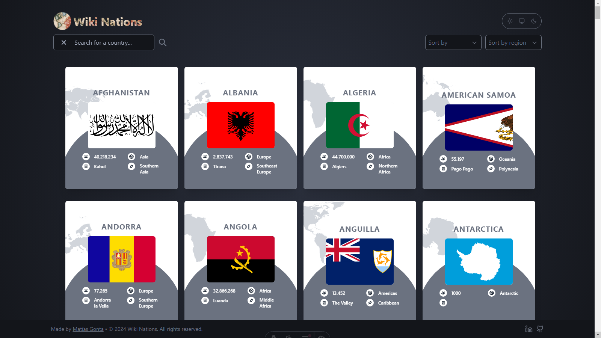

  

---

# Wiki Nations

Wiki Nations is a web application that provides detailed information about all countries in the world. From an easy-to-navigate home page to individual country profiles, Wiki Nations offers an intuitive experience for exploring and learning about different countries on the planet.

You can <a href="https://www.youtube.com/watch?v=-AkzsgSKUX0" target="_blank">**click here**</a> para ver una visión general y características clave de la aplicación en acción.

## Features

- Efficient country filtering with the ability to sort the list of countries according to your preferences, whether from low to high, high to low, by search or by region.
- Detailed profiles for each country where you can access broader information, including data such as population, area, geographic coordinates, capital, languages, currencies and more.
- Explore the list of countries and their profiles easily and quickly thanks to an intuitive and friendly interface. Supported by the use of Astro's View Transitions.
- Theme system, where you can customize the visual appearance according to the user's preference between light and dark.
- Responsive design for a pleasant experience on any device.
- Quickly find the information you are looking for thanks to a design that prioritizes ease of use and accessibility.

## Technologies Used

- <a href="https://www.typescriptlang.org/docs/" target="_blank">**Typescript**</a>: A superset of JavaScript that adds static types and other features to the language syntax.
- <a href="https://astro.build/" target="_blank">**Astro**</a>: A modern static site generator that brings performance and developer experience to the forefront, offering a seamless and efficient development process.
- <a href="https://tailwindcss.com/" target="_blank">**Tailwind CSS**</a>: A utility-first CSS framework that simplifies styling by providing low-level utility classes, enabling a straightforward and fast approach to building modern and responsive interfaces.
- <a href="https://axios-http.com/" target="_blank">**Axios**</a>: A popular library for making HTTP requests.
- <a href="https://restcountries.com/" target="_blank">**REST Countries**</a>: A data API that provides detailed and up-to-date information about countries.

## Project Structure

- `src/assets`: Contains static assets such as images and videos used in the application.
- `src/components`: Contains reusable components used in different parts of the application.
- `src/pages`: Contains all the pages within the application.
- `src/layouts`: Contains files where the general structure of the sections or pages of the application is defined, acting as a template to achieve visual coherence.
- `src/services`: Contains the countries service responsible for fetching data from the REST Countries.
- `src/icons`: Stores SVG icons used in the application.
- `src/types`: Contains TypeScript interfaces or types used for defining data structures.
- `src/utils`: Contains utilities and helper functions used in the application.

## Authors

- Matías Gonta

If you have any questions, concerns or interest, feel free to contact me.

---

  

---

# Wiki Nations

Wiki Nations es una aplicación web que proporciona información detallada sobre todos los países del mundo. Desde una página principal fácil de navegar hasta perfiles individuales de países, Wiki Nations ofrece una experiencia intuitiva para explorar y aprender sobre diferentes paises del planeta.

Puedes hacer <a href="https://www.youtube.com/watch?v=-AkzsgSKUX0" target="_blank">**clic aquí**</a> para ver una visión general y características de la aplicación en acción.

## Características

- Filtrado eficiente de países con la capacidad de ordenar la lista de países de acuerdo a tus preferencias, ya sea de menor a mayor, de mayor a menor, por búsqueda o por región.
- Perfiles detallados para cada país donde acceder a información más amplica, incluyendo datos como población, área, coordenadas geográficas, capital, idiomas, monedas y más.
- Explora la lista de países y sus perfiles de manera sencilla y rápida gracias a una interfaz intuitiva y amigable. Apoyada en la utilización de View Transitions de Astro.
- Sistema de temas, donde personalizar la apariencia visual según la preferencia del usuario entre claro y oscuro.
- Diseño responsivo para una experiencia agradable en cualquier dispositivo.
- Encuentra rápidamente la información que buscas gracias a un diseño que prioriza la facilidad de uso y accesibilidad.

## Tecnologías utilizadas

- <a href="https://www.typescriptlang.org/docs/" target="_blank">**Typescript**</a>: Un superconjunto de JavaScript que agrega tipos estáticos y otras funciones a la sintaxis del lenguaje.
- <a href="https://astro.build/" target="_blank">**Astro**</a>: Un moderno generador de sitios estáticos que pone el rendimiento y la experiencia del desarrollador en primer plano, ofreciendo un proceso de desarrollo fluido y eficiente.
- <a href="https://tailwindcss.com/" target="_blank">**Tailwind CSS**</a>: Un framework de CSS centrado en las utilidades, que simplifica el estilo al proporcionar clases de utilidades de bajo nivel, lo que permite un enfoque sencillo y rápido para crear interfaces modernas y responsivas.
- <a href="https://axios-http.com/" target="_blank">**Axios**</a>: Una biblioteca popular para realizar solicitudes HTTP.
- <a href="https://restcountries.com/" target="_blank">**REST Countries**</a>: Una API de datos que proporciona información detallada y actualizada sobre paises.

## Estructura del proyecto

- `src/assets`: Contiene activos estáticos como imágenes o videos utilizados en la aplicación.
- `src/components`: Contiene componentes reutilizables utilizados en diferentes partes de la aplicación.
- `src/pages`: Contiene todas las páginas dentro de la aplicación.
- `src/layouts`: Contiene archivos donde se define la estructura general de las secciones o páginas de la aplicación, actuando como plantilla para lograr coherencia visual.
- `src/services`: Contiene el servicio responsable de obtener los datos de paises desde REST Countries.
- `src/icons`: Almacena iconos SVG utilizados en la aplicación.
- `src/types`: Contiene interfaces o tipos de TypeScript utilizados para definir estructuras de datos.
- `src/utils`: Contiene utilidades y funciones auxiliares utilizadas en la aplicación.

## Autores

- Matías Gonta

Si tiene alguna pregunta, inquietud o interés, no dude en ponerse en contacto conmigo.